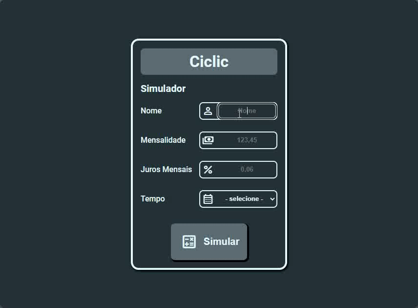
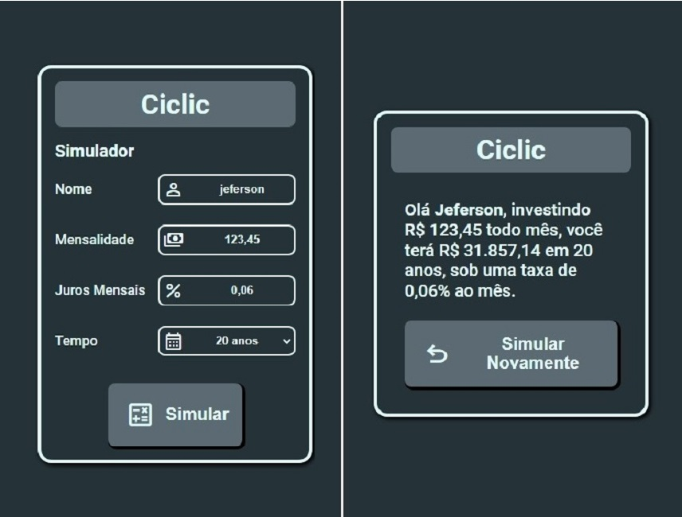
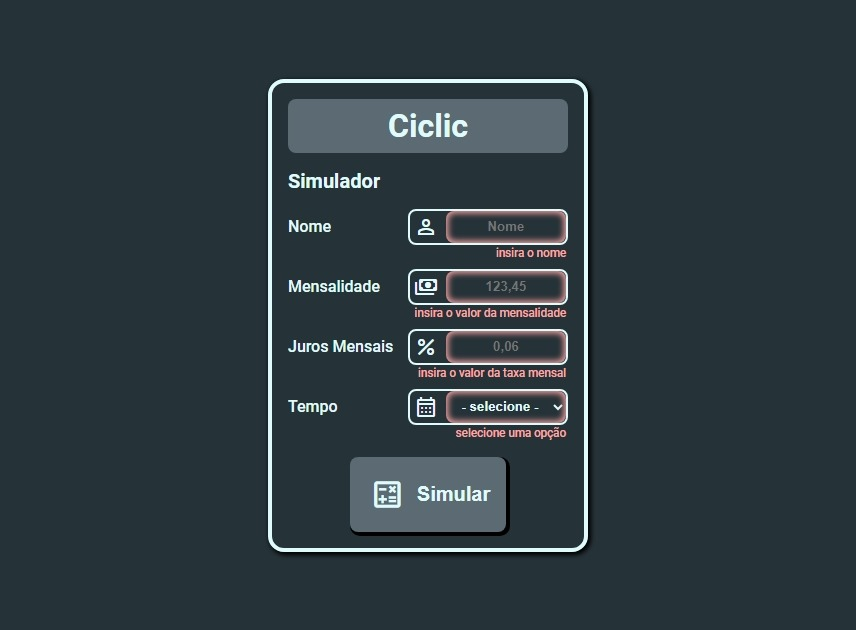

# Simulador de Juros Compostos - desafio front-end Formação Full Stack Javascript

Esta aplicação consiste na solução de um desafio de desenvolvimento de um **simulador de juros compostos** presente na **Formação Full Stack Javascript.**

## Índice

- [Visão geral](#visão-geral)
  - [O Desafio](#o-desafio)
    - [Comportamento esperado](#comportamento-esperado)
    - [Design](#design)
    - [Critérios do desafio](#critérios-do-desafio)
- [Utilizando a aplicação](#utilizando-a-aplicação)
  - [Screenshots](#screenshots)
  - [Links](#links)
- [Meu processo](#meu-processo)
  - [O que aprendi](#o-que-aprendi)
  - [Recursos úteis](#recursos-úteis)
- [Autor](#autor)

## Visão geral

[▲ Volta para o índice](#índice)

### O desafio

O desafio consiste em uma aplicação para simulação de juros compostos de um investimento com duas telas, uma para coleta de dados e a outra para exibição do resultado. o Desafio original pode ser encontrado [aqui](https://github.com/thiagocontaparatestes/testes-vaga-emprego/blob/main/teste-juros-compostos.md).

#### Comportamento esperado

##### Primeira tela

A primeira tela deve ter um formulário com os campos: nome, mensalidade, taxa de juros, tempo de contribuição e um botão simular.

Ao clicar em simular, deve ser feito um POST na [api math.js](http://api.mathjs.org/v4/).

O body deverá ser um JSON com a seguinte estrutura: `{ "expr": "" }`. Em `expr` vai a expressão matemática para calcular o juros compostos. Deverá  ser usada a seguinte fórmula:

- `[valor da mensalidade * (((1 + [taxa de juros]) ^ [tempo de contribuicao em meses] - 1) / [taxa de juros])`.

**Exemplo:**

Se os parametros forem:

> Valor da mensalidade: **R$ 20,00**
>
> Taxa de juros: **0,517% ao mês**
>
> Tempo de contribuição: **2 anos**

O body da request deverá ser:

```json
{ "expr": "20 * (((1 + 0.00517) ^ 24 - 1) / 0.00517)" }
```

##### Segunda tela

A segunda tela deverá exibir um texto com as informaçoes dos campos de nome, mensalidade, tempo e o resultado da request.

**Exemplo:**

>Olá **\[nome\]**, investindo R$**\[mensalidade\]** todo mês,
>
>você terá **R$\[resultado da request\]** em **\[tempo\]**,
>
>sob uma taxa de juros de **\[taxa\]** ao mês.

#### Design

**Wireframe de exemplo:**


#### Critérios do desafio

- HTML, CSS e JavaScript puros.
- Layout livre.

## Utilizando a aplicação

[▲ Volta para o índice](#índice)

Para executar este projeto, basta baixar os arquivos e abrir o arquivo "index.html" com seu navegador de internet, ou clicar na [URL do site ativo](https://jefersonborges.github.io/ffjs-compound-interest-challenge/).

**Elementos interativos:**

- **Tela de entrada de dados:**
  - Campo **"Nome"** - Inserir o primeiro nome.
  - Campo **"Mensalidade"** - Inserir o valor da memnsalidade com vírgula.
  - Campo **"Juros mensais"** - Inserir o valor da porcentagem de juros com até duas casas depois da vírgula.
  - Campo **Tempo** - Selecionar do tempo de investimento em (até 20) anos.
  - Botão **Simular** - Clicar para simular o investimento

- **Tela de resultados**
  - **Exibe** o resultado da simulação exibindo o valor total dentro dos parâmetros inseridos (nome, mensalidade, taxa de juros e tempo de contribuição).
  - Botão **"Simular Novamente"** - Volta a tela inicial, mantendo os dados inseridos anteriores.

### Screenshots





### Links

- Solution URL: [Github repository](https://github.com/jefersonBorges/ffjs-compound-interest-challenge)
- Live Site URL: [Github live page](https://jefersonborges.github.io/ffjs-compound-interest-challenge/)

## Meu processo

[▲ Volta para o índice](#índice)

**Feito com:**

- **HTML** semântico
- **CSS**
  - Flexbox
  - Grid
- **Javascript**
  - OOP
  - ES6 Features
  - Async
  - Event Handling
  - DOM
  - Client-side form validation

### O que aprendi

Utilizando fetch com POST:

```js

const api = {
  url: 'http://api.mathjs.org/v4/',

  setConfigs: function(monthlyPayment, monthlyInterestRate, paymentPeriod) {
    const bodyData = {
      expr: `${monthlyPayment} * (((1 + ${monthlyInterestRate}) ^ ${paymentPeriod} - 1) / ${monthlyInterestRate})`
    }

    this.configs = {
      method: "POST",
      headers: { "content-type": "application/json" },
      body: JSON.stringify(bodyData)
    }
  },

  getSimulationResult: async function(monthlyPayment, monthlyInterestRate, paymentPeriod) {
    this.setConfigs(monthlyPayment, monthlyInterestRate, paymentPeriod)

    return fetch(this.url, this.configs)
      .then(response => response.json())
      .then(response => response.result)
  }
}

```

Utilizei orientação à objetos para formatar o body da requisição post, com isto consegui deixar o código modular e mais legível.

Utilizando classes e variáveis CSS para controlar o estado de animações:

```CSS

  :root {
  --f-out: fade-out 1s linear;
  --f-in: fade-in 1s linear;
  --rotate: rotate-clockwise 1s linear infinite;
  }
  @keyframes fade-in {
    0% { opacity: 0; }
    100% { opacity: 1; }
  }
  @keyframes fade-out {
    0% { opacity: 1; }
    100% { opacity: 0; }
  }
  @keyframes rotate-clockwise {
    100% { 
      -webkit-transform: rotate(360deg);
      transform: rotate(360deg); 
    }
  }
  .investment-simulation-data-entry.visible {
    animation: var(--f-in);
    display: grid;
  }
  .investment-simulation-data-entry.hidden {
    animation: var(--f-out);
    display: none;
  }
  button > .simulateIcon{
    display: block;
  }
  button > .loadingIcon{
    display: none;
  }
  button.loading > .simulateIcon{
    display: none;
  }
  button.loading > .loadingIcon{
    display: block;
    animation: var(--rotate);
  }

```

Utilizando o CSS com variáveis e classes foi possível controlar o estado de das animações com um código JavaScript mais simples

```js

  displayElement: function(element) {
    if(element.classList.contains('hidden')) {
      element.classList.remove('hidden')
    }
    if(!element.classList.contains('visible')) {
      element.classList.add('visible')
    }
  },

  hideElement: function(element) {
    if(element.classList.contains('visible')) {
      element.classList.remove('visible')
    }
    if(!element.classList.contains('hidden')) {
      element.classList.add('hidden')
    }
  },

  setLoadingState: function() {
    if(!this.simulateButton.classList.contains('loading')) {
      this.simulateButton.classList.add('loading') 
    }
  },

  removeLoadingState: function(){
    if(this.simulateButton.classList.contains('loading')) {
      this.simulateButton.classList.remove('loading') 
    }
  }

```

### Recursos úteis

- **Documentação:** [Number to locale string](https://developer.mozilla.org/en-US/docs/Web/JavaScript/Reference/Global_Objects/Number/toLocaleString)
- **Documentação:** [Element Classlist](https://developer.mozilla.org/en-US/docs/Web/API/Element/classList)
- **Vídeo:** [Animate from display none](https://youtu.be/4prVdA7_6u0)

## Autor

[▲ Volta para o índice](#índice)

- GitHub - [jefersonBorges](https://github.com/jefersonBorges/jefersonBorges)
- Frontend Mentor - [@jefersonBorges](https://www.frontendmentor.io/profile/jefersonBorges)
- Linkedin - [Jeferson Borges Linkedin](https://www.linkedin.com/in/jeferson-borges-543b34229)

---
